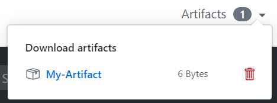

# Github Action Build Chain

Github action build chain is a tool for github actions to build multiple projects from different repositories in a single action.
This tool is trying to solve the problem when a project depends on another project (most probably from the same organization) and one change can/should be performed in different repositories. How can we assure one specific pull request will work with the latest changes from/in the dependant/dependency projects and it won't break something? This is what we call **cross-repo pull requests** and **build-chain** is the way we have to solve it.

Let's consider you have a project hierarchy like:


and you want to upstream/downstream build whatever project from this hierarchy, **Github Action Build Chain** provides you the mechanism to easily do it.
You can check [Usage example](#usage-example).

Just defining the **build chain** flow in every project from the chain, the tool will get meta-info from them and will compose but a chain build means for you and will execute in a single github action.

## Build Chain Flows

### Pull request flow

- It checks out the current project and reads the workflow information from the YAML file triggering the job.

  - It merges the TARGET_GROUP:PROJECT:TARGET_BRANCH into the SOURCE_GROUP:PROJECT:SOURCE_BRANCH from the pull request triggering the job.
    > **_Warning:_** It will fail in case it can't be done automatically, properly informing to please resolve conflicts.

- It recursively checks out and read workflow information for the rest of the `parent-dependencies` defined in every YAML flow file.

  - For each parent dependency:
    - It will look for forked project belonging same github group as the one triggering the job.
    - It will try to checkout SOURCE_GROUP:PROJECT:SOURCE_BRANCH. In case the it exists and it has a pull request over the TARGET_GROUP:PROJECT:TARGET_BRANCH it will check it out and will merge it with target branch.
    - If previous checkout fails, it will try the same with TARGET_GROUP:PROJECT:SOURCE_BRANCH this time.
    - If previous checkout fails, it will checkout TARGET_GROUP:PROJECT:TARGET_BRANCH.
      > **_Warning:_** It will fail in case it can't be done automatically, properly informing to please resolve conflicts.

- Once all the projects are checked out, it will run as many commands are defined in `build-command-upstream` input (it will take `build-command` input in case there's no `build-command-upstream` defined) for every parent dependency starting from the highest level of the hierarchy to the lowest one.

- It will run as many commands are defined in `build-command`for the project triggering the job.

- It will archive artifacts in case `archive-artifacts-path` input is defined.

## How to add it to your project(s)

It is just to add the step (replacing dependencies and commands):

```
- name: Build Chain
      id: build-chain
      uses: kiegroup/github-action-build-chain
      with:
        parent-dependencies: 'projectA'
        child-dependencies: |
          projectC
          projectD
        build-command: 'mvn whatever goals'
        build-command-upstream: 'mvn whatever goals'
        workflow-file-name: "whatever_flow.yml"
```

to your existing yaml flow definition or to create a new one. Do the same for the rest of the projects you need. The `@actions/checkout` step is not needed since is the tool the one which is going to handle what to checkout for every project in the chain.

## Input Fields

See [action.yml](action.yml)

- **parent-dependencies** (optional): `[group/]projectName[@branchSource:branchTarget][|[flowfile.yaml][:jobId]]]` The parent projects dependencies to depend on. You can defined several depencies thanks to the [yaml block scalar functionality](https://yaml.org/spec/1.2/spec.html#Block). They are basically the projects to depend on.
  - `group/`: (optional) The github group where the project is, otherwise it will be taken from same group.
  - `projectName`: (mandatory) The project name.
  - `@branchSource:branchTarget`: (optional) It is possible to map branches for projects. `projectx@master:7.x` would map whatever pull request is performed for `master` branch to `projectX:7.x`.
  - `|flowfile.yaml`: (optional) in case the dependency has a different flow file name.
  - `|:jobId`: (optional) in case the dependency has a different jobId.

> Example:
>
> ```
> parent-dependencies: 'projectA'
> parent-dependencies: |
>   projectA
>   groupX/projectB
>   projectC@master:7.x
>   groupy/projectD@8.0.0:9.0.1
>   groupy/projectD|flow.yml:jobIdX
>   groupy/projectD|:jobIdX
>   groupy/projectD|flow.yml
>   groupy/projectD@8.0.0:9.0.1|flow.yml:jobIdX
>   groupy/projectD@8.0.0:9.0.1|:jobIdX
>   groupy/projectD@8.0.0:9.0.1|flow.yml
> ```

- **child-dependencies** (optional): `[group/]projectName[@branchSource:branchTarget][|[flowfile.yaml][:jobId]]]` The child projects dependencies that depends on this project. You can defined several depencies thanks to the [yaml block scalar functionality](https://yaml.org/spec/1.2/spec.html#Block).
  - `group/`: (optional) The github group where the project is, otherwise it will be taken from the same group.
  - `projectName`: (mandatory) The project name.
  - `@branchSource:branchTarget`: (optional) It is possible to map branches for projects. `projectx@master:7.x` would map whatever pull request is performed for `master` branch to `projectX:7.x`.
  - `|flowfile.yaml`: (optional) in case the dependency has a different flow file name.
  - `|:jobId`: (optional) in case the dependency has a different jobId.

> Examples:
>
> ```
> child-dependencies: 'projectA'
> child-dependencies: |
>   projectA
>   groupX/projectB
>   projectC@master:7.x
>   groupy/projectD@8.0.0:9.0.1
>   groupy/projectD|flow.yml:jobIdX
>   groupy/projectD|:jobIdX
>   groupy/projectD|flow.yml
>   groupy/projectD@8.0.0:9.0.1|flow.yml:jobIdX
>   groupy/projectD@8.0.0:9.0.1|:jobIdX
>   groupy/projectD@8.0.0:9.0.1|flow.yml
> ```

- **build-command** (required): `command1[\ncommand2\ncommand3]` The command(s) to build. You can defined several commands thanks to the [yaml block scalar functionality](https://yaml.org/spec/1.2/spec.html#Block).

  > Example:
  >
  > ```
  > build-command: 'mvn clean install'
  > build-command: |
  >   mvn clean install
  >   mvn -e -nsu -Dfull -Pwildfly clean install -Prun-code-coverage  -Dcontainer.profile=wildfly -Dcontainer=wildfly -Dintegration-tests=true -Dmaven.test.failure.ignore=true -DjvmArgs="-Xms1g -Xmx4g"
  > build-command: |
  >   sh scripts/prepare_environment_build_images.sh
  >   mkdir -p ${{ matrix.images }}
  >   rsync -av --progress . ${{ matrix.images }} --exclude workspaces
  >   make ${{ matrix.images }} ignore_test=true cekit_option="--work-dir .
  >   make ${{ matrix.images }} ignore_build=true cekit_option="--work-dir .
  > ```

- **build-command-upstream** (optional): `command1[\ncommand2\ncommand3]` The command(s) to build in case the project is built by a child project. If it's not defined `build-command` will be taken. You can defined several commands thanks to the [yaml block scalar functionality](https://yaml.org/spec/1.2/spec.html#Block).

  > Example:
  >
  > ```
  > build-command-upstream: 'mvn clean install'
  > build-command-upstream:  |
  >   mvn clean install
  >   mvn -e -nsu -Dfull -Pwildfly clean install -Prun-code-coverage  -Dcontainer.profile=wildfly -Dcontainer=wildfly -Dintegration-tests=true -Dmaven.test.failure.ignore=true -DjvmArgs="-Xms1g -Xmx4g"
  > ```

- **workflow-file-name** (required): `file_name.yml` it defines which workflow file name will be taken from the rest of the projects to get metainfo. _This is the most embarrassing field we have here :pensive:. It's due to github does not provide filename in case the `name` is defined for the flow. The information is stored in `GITHUB_WORKFLOW` environment variable but it's overridden in case you define a name for it (which is the most common thing). It is better explained in [workflow-file-name section](#workflow-file-name)_.

  > **_Warning:_** The flow files should be placed in `.github/workflows` folder for every project from the chain. Don't specify `.github/workflows/whateverflowfilename.yaml`, just `whateverflowfilename.yaml`.

  > Example:
  >
  > ```
  > workflow-file-name: "pull_request.yml"
  > workflow-file-name: "whateverflowfilename.yml"
  > ```

- **matrix-variables** (optional): `key:${{ flowvariable1 }}[\nkey2:${{ flowvariable2 }}\nmatrix.variable:${{ matrix.variable }}]` define it in case you use matrix variables in your with parameters.

  > Examples:
  >
  > ```
  > build-command: mkdir -p ${{ matrix.images }}
  > matrix-variables: matrix.images:${{ matrix.images }}
  > ```

  > ```
  > build-command-upstream: |
  >   mkdir -p ${{ matrix.images }}
  >   rsync -av --progress . ${{ matrix.os }}
  > matrix-variables: |
  >   matrix.images:${{ matrix.images }}
  >   matrix.os:${{ matrix.os }}
  > ```

- **archive-artifacts-path** (optional): `file path` (see: [@actions/glob](https://github.com/actions/toolkit/tree/main/packages/glob) and [Archiving Artifacts](#archiving-artifacts)). define it in case you want to archive artifacts after building the project chain.

  > Example: see [Archiving Artifacts](#archiving-artifacts)

- **archive-artifacts-name** (optional, default: `the project name`): `a string` (see: [Archiving Artifacts](#archiving-artifacts) and [Uploading without an artifact name](#uploading-without-an-artifact-name)). define it in case you want to archive artifacts after building the project chain.

  > **_Warning:_** `archive-artifacts-path` input is mandatory in case you want to use this field (it does not make sense to specify an artifact name without defining what you want to upload)

  > Example: see [Archiving Artifacts](#archiving-artifacts)

- **archive-artifacts-if-no-files-found** (optional, default: `warn`): `warn|ignore|error` (see: [Archiving Artifacts](#archiving-artifacts) and [Customization if no files are found](#customization-if-no-files-are-found)). Allows you to customize the behavior of the action if no files are found.

  > **_Warning:_** `archive-artifacts-path` input is mandatory in case you want to use this field (it does not make sense to specify the failure behaviour without defining what you want to upload)

  > Example: see [Archiving Artifacts](#archiving-artifacts)

- **archive-artifacts-dependencies** (optional, default: `none`): `all|none|list of projects` (see: [Archiving Artifacts](#archiving-artifacts) and [archive-artifacts-dependencies usage](#archive-artifacts-dependencies-usage)). Allows you to decide which projects you want treat to upload artifacts from the project triggering the job.

  > **_Note:_** `archive-artifacts-path` input is **NOT** mandatory in case you want to use this field

  > Example: see [Archiving Artifacts](#archiving-artifacts)

## Archiving Artifacts

The archive artifacts algorithm is basically copied from [actions/upload-artifact project](https://github.com/actions/upload-artifact) and (manually) transpile to javascript. The usage is basically the same (the inputs are different named adding `archive-artifacts` prefix and the [Conditional Artifact Upload](https://github.com/actions/upload-artifact#conditional-artifact-upload) is not enabled), so why do we include this `archive artifacts` mechanism in this tool if it's already implemented by another tool? well, because this treats the archive artifacts mechanism for the whole build chain, so in case you define an `archive-artifacts-path` in a different project from the chain, all of them will be uploaded. If you are wondering if you are able to use `actions/upload-artifact` instead of the one we propose, the answer is 'yes', just take into consideration the artifacts will be archived based on the definition from the project triggering the job.

### Upload an Individual File

```yaml
steps:
- uses: kiegroup/github-action-build-chain
  with:
    ...
    ...
    archive-artifacts-name: my-artifact
    archive-artifacts-path: path/to/artifact/world.txt
```

### Upload an Entire Directory

```yaml
steps:
- uses: kiegroup/github-action-build-chain
  with:
    ...
    ...
    archive-artifacts-name: my-artifact
    archive-artifacts-path: path/to/artifact/ # or path/to/artifact
```

### Upload using a Wildcard Pattern

```yaml
steps:
- uses: kiegroup/github-action-build-chain
  with:
    ...
    ...
    archive-artifacts-name: my-artifact
    archive-artifacts-path: path/**/[abc]rtifac?/*
```

### Upload using Multiple Paths and Exclusions

```yaml
steps:
- uses: kiegroup/github-action-build-chain
  with:
    ...
    ...
    archive-artifacts-name: my-artifact
    archive-artifacts-path: |
      path/output/bin/
      path/output/test-results
      !path/**/*.tmp
```

For supported wildcards along with behavior and documentation, see [@actions/glob](https://github.com/actions/toolkit/tree/main/packages/glob) which is used internally to search for files.

If a wildcard pattern is used, the path hierarchy will be preserved after the first wildcard pattern.

```
    path/to/*/directory/foo?.txt =>
        ∟ path/to/some/directory/foo1.txt
        ∟ path/to/some/directory/foo2.txt
        ∟ path/to/other/directory/foo1.txt

    would be flattened and uploaded as =>
        ∟ some/directory/foo1.txt
        ∟ some/directory/foo2.txt
        ∟ other/directory/foo1.txt
```

If multiple paths are provided as input, the least common ancestor of all the search paths will be used as the root directory of the artifact. Exclude paths do not effect the directory structure.

Relative and absolute file paths are both allowed. Relative paths are rooted against the current working directory. Paths that begin with a wildcard character should be quoted to avoid being interpreted as YAML aliases.

The [@actions/artifact](https://github.com/actions/toolkit/tree/main/packages/artifact) package is used internally to handle most of the logic around uploading an artifact. There is extra documentation around upload limitations and behavior in the toolkit repo that is worth checking out.

### Customization if no files are found

If a path (or paths), result in no files being found for the artifact, the action will succeed but print out a warning. In certain scenarios it may be desirable to fail the action or suppress the warning. The `if-no-files-found` option allows you to customize the behavior of the action if no files are found.

```yaml
steps:
- uses: kiegroup/github-action-build-chain
  with:
    ...
    ...
    archive-artifacts-name: my-artifact
    archive-artifacts-path: path/to/artifact/
    archive-artifacts-if-no-files-found: error # 'warn' or 'ignore' are also available, defaults to `warn`
```

### Conditional Artifact Upload

not supported (yet)

### Uploading without an artifact name

You can upload an artifact without specifying a name

```yaml
- uses: kiegroup/github-action-build-chain
  with:
    ...
    ...
    archive-artifacts-path: path/to/artifact/world.txt
```

If not provided, `artifact` will be used as the default name which will manifest itself in the UI after upload.

### Uploading to the same artifact

Each artifact behaves as a file share. Uploading to the same artifact multiple times in the same workflow can overwrite and append already uploaded files

```yaml
# Project A
- uses: kiegroup/github-action-build-chain
  with:
    ...
    ...
    archive-artifacts-path: world.txt
```

```yaml
# Project B
- uses: kiegroup/github-action-build-chain
  with:
    ...
    ...
    archive-artifacts-path: extra-file.txt
```

```yaml
# Project C
- uses: kiegroup/github-action-build-chain
  with:
    ...
    ...
    archive-artifacts-path: world.txt
```

With the following example, the available artifact (named `artifact` which is the default if no name is provided) would contain both `world.txt` and `extra-file.txt`.

> **_Warning:_** Be careful when uploading to the same artifact via multiple jobs as artifacts may become corrupted

```yaml
    strategy:
      matrix:
          java-version: [8, 9, 11, 13]
    steps:
        - name: Set up JDK 1.8
          uses: actions/setup-java@v1
          with:
            java-version: ${{ matrix.java-version }}
        - name: 'Accidently upload to the same artifact via multiple jobs'
        uses: kiegroup/github-action-build-chain
          with:
            ...
            ...
            archive-artifacts-name: my-artifact
            archive-artifacts-path: world.txt
```

In the above example, four jobs will upload four different files to the same artifact but there will only be one file available when `my-artifact` is downloaded. Each job overwrites what was previously uploaded. To ensure that jobs don't overwrite existing artifacts, use a different name per job.

```yaml
    - uses: kiegroup/github-action-build-chain
        with:
          ...
          ...
          archive-artifacts-name: my-artifact ${{ matrix.java-version }}
          archive-artifacts-path: world.txt
          matrix-variables: "matrix.java-version:${{ matrix.java-version }}
```

### Environment Variables and Tilde Expansion

You can use `~` in the path input as a substitute for `$HOME`. Basic tilde expansion is supported.

```yaml
  - uses: kiegroup/github-action-build-chain
      with:
        ...
        ...
        archive-artifacts-name: 'Artifacts-V2'
        archive-artifacts-path: '~/new/**/*'
```

### archive-artifacts-dependencies usage

The idea of the field `archive-artifacts-dependencies` is to allow to define from the project triggering the job which artifacts you want to archive from the whole chain. Possible values:

- `none` no artifact from its dependencies will be uploaded, no matter what the dependencies projects define.
- `all` all artifacts from its dependencies will be uploaded, dependending on what the dependencies define.
- `list of projects` define which of the projects in the chain will be treated to upload artifacts, dependending on what the dependencies define.

```yaml
  - uses: kiegroup/github-action-build-chain
      with:
        ...
        ...
        archive-artifacts-path: '~/new/**/*'
        archive-artifacts-dependencies: 'none'
```

```yaml
  - uses: kiegroup/github-action-build-chain
      with:
        ...
        ...
        archive-artifacts-path: '~/new/**/*'
        archive-artifacts-dependencies: 'all'
```

```yaml
  - uses: kiegroup/github-action-build-chain
      with:
        ...
        ...
        archive-artifacts-path: '~/new/**/*'
        archive-artifacts-dependencies: |
          projectX
          projectY
```

## Where does the upload go?

In the top right corner of a workflow run, once the run is over, if you used this action, there will be a `Artifacts` dropdown which you can download items from. Here's a screenshot of what it looks like<br/>


There is a trashcan icon that can be used to delete the artifact. This icon will only appear for users who have write permissions to the repository.

# Limitations

### Zipped Artifact Downloads

During a workflow run, files are uploaded and downloaded indivdually using the `upload-artifact` and `download-artifact` actions. However, when a workflow run finishes and an artifact is downloaded from either the UI or through the [download api](https://developer.github.com/v3/actions/artifacts/#download-an-artifact), a zip is dynamically created with all the file contents that were uploaded. There is currently no way to download artifacts after a workflow run finishes in a format other than a zip or to download artifact contents individually. One of the consequences of this limitation is that if a zip is uploaded during a workflow run and then downloaded from the UI, there will be a double zip created.

### Permission Loss

:exclamation: File permissions are not maintained during artifact upload :exclamation: For example, if you make a file executable using `chmod` and then upload that file, post-download the file is no longer guaranteed to be set as an executable.

### Case Insensitive Uploads

:exclamation: File uploads are case insensitive :exclamation: If you upload `A.txt` and `a.txt` with the same root path, only a single file will be saved and available during download.

## Execution environment

The environment execution definition is part of the worklfow (the `.yml` file) and it depends on the commands you require to execute. If you require to execute maven commands you will have to add the `actions/setup-java@v1` with its java version, or in case you need python commands `actions/setup-python` is the one. You can find differente examples in https://github.com/YOURGROUP/YOURPROJECT/actions/new.

It could be the case where you require a very specific environment to execute your stuff as it is the case for [python3-cekit](https://github.com/kiegroup/github-action-build-chain/tree/python3-cekit). Feel free to propose the environment you need as a pull request to this project:

- Create a branch based on `python3-cekit` one
- Modify [the Dockerfile from there](https://github.com/kiegroup/github-action-build-chain/blob/python3-cekit/Dockerfile)

Current environments:

- **python3-cekit**: python3 + python cekit library + docker + nodejs + yarn latest stable release [Dockerfile](https://github.com/kiegroup/github-action-build-chain/blob/python3-cekit/Dockerfile)

## Usage example

Considering the projects hierarchy:


**Project A**

```
name: Build Chain

on: [pull_request]

jobs:
  build-chain-openjdk8:
    runs-on: ubuntu-latest
    name: Pull Request openjdk8
    steps:
    - name: Set up JDK 1.8
      uses: actions/setup-java@v1
      with:
        java-version: 1.8
    - name: Build Chain
      id: build-chain
      uses: kiegroup/github-action-build-chain
      with:
        child-dependencies: |
          projectC
          projectD
        build-command: 'mvn whatever goals'
        build-command-upstream: 'mvn whatever goals'
        workflow-file-name: "whatever_flow.yml"
```

**Project B**

```
name: Build Chain

on: [pull_request]

jobs:
  build-chain-openjdk8:
    runs-on: ubuntu-latest
    name: Pull Request openjdk8
    steps:
    - name: Set up JDK 1.8
      uses: actions/setup-java@v1
      with:
        java-version: 1.8
    - name: Build Chain
      id: build-chain
      uses: kiegroup/github-action-build-chain
      with:
        child-dependencies: 'projectD'
        build-command: 'mvn whatever goals'
        build-command-upstream: 'mvn whatever goals'
        workflow-file-name: "whatever_flow.yml"
```

**Project C**

```
name: Build Chain

on: [pull_request]

jobs:
  build-chain-openjdk8:
    runs-on: ubuntu-latest
    name: Pull Request openjdk8
    steps:
    - name: Set up JDK 1.8
      uses: actions/setup-java@v1
      with:
        java-version: 1.8
    - name: Build Chain
      id: build-chain
      uses: kiegroup/github-action-build-chain
      with:
        parent-dependencies: 'projectD'
        build-command: 'mvn whatever goals'
        build-command-upstream: 'mvn whatever goals'
        workflow-file-name: "whatever_flow.yml"
```

**Project D**

```
name: Build Chain

on: [pull_request]

jobs:
  build-chain-openjdk8:
    runs-on: ubuntu-latest
    name: Pull Request openjdk8
    steps:
    - name: Set up JDK 1.8
      uses: actions/setup-java@v1
      with:
        java-version: 1.8
    - name: Build Chain
      id: build-chain
      uses: kiegroup/github-action-build-chain
      with:
        parent-dependencies: |
          projectA
          projectB
        child-dependencies: 'projectE'
        build-command: 'mvn whatever goals'
        build-command-upstream: 'mvn whatever goals'
        workflow-file-name: "whatever_flow.yml"
```

**Project E**

```
name: Build Chain

on: [pull_request]

jobs:
  build-chain-openjdk8:
    runs-on: ubuntu-latest
    name: Pull Request openjdk8
    steps:
    - name: Set up JDK 1.8
      uses: actions/setup-java@v1
      with:
        java-version: 1.8
    - name: Build Chain
      id: build-chain
      uses: kiegroup/github-action-build-chain
      with:
        parent-dependencies: 'projectD'
        build-command: 'mvn whatever goals'
        build-command-upstream: 'mvn whatever goals'
        workflow-file-name: "whatever_flow.yml"
```

## Docker build

You can build the `github-action-build-chain` image locally with just executing docker command:

```
docker build .
```

In case you want to build it for a different openjdk version you just specify a `--build-arg OPENJDK_VERSION` argument:

```
docker build --build-arg OPENJDK_VERSION=11 .
```

## Testing

### Unit testing

- **TEST_GITHUB_TOKEN** env variable is needed.

### Integration testing

In order to execute integration testing you just run `env GITHUB_TOKEN=%TOKEN% URL=%GITHUB_EVENT_URL% workflow-file-name=%WORKFLOW_FILE_NAME% GITHUB_JOB='%GITHUB_JOB%' yarn it` where:

- %TOKEN%: is your personal token, like `1e2ca1ac1252121d83fbe69ab3c4dd92bcb1ae32`.
- %GITHUB_EVENT_URL%: the url to your event to test, like `https://github.com/kiegroup/kogito-images/pull/220`.
- %WORKFLOW_FILE_NAME%: the workflow file name located in `.github/workflows` folder, like `build_images.yml`.
- %GITHUB_JOB%: the job id from the `%WORKFLOW_FILE_NAME%` to execute.

So the final command would look like
`env GITHUB_TOKEN=3e6ce1ac1772121d83fbe69ab3c4dd92dad1ae40 URL=https://github.com/kiegroup/lienzo-core/pull/3 workflow-file-name=pull_request.yml GITHUB_JOB='build-chain-openjdk8' yarn it`.

## Github limitations

### workflow-file-name

You are probably wondering why the input field `workflow-file-name` even exists. Why don't we take the filename directly from the job and keep the same name for all the flow files in the chain?. Well, we can in case the `name` is not defined in the flow, then the file name information can be taken from `GITHUB_WORKFLOW` environment variable but in case the name is set, `GITHUB_WORKFLOW` becomes the name and there's no other way to get filename from the tool.
This is a github action limitation already reported as a suggestion to provide file name from the flow triggering the job.

### inputs usage in runs.image from action.yml

> Just in case you are interested in adapting this code or in case you want to create your own tool.

It's not possible to use expressions like `image: "docker://kie-group:github-action-build-chain:{{ inputs.build-chain-build-system }}"`. This way it would be easy to dynamically select image to run with a simple `with` input from flow yml file and we could skip errors like [matrix in uses](#matrix-in-uses).
Just because of this we have to maintain different Dockerfile definitions in different branches and to tag every branch for every version we release like `python3-cekit-v1`.

### Contributors

<table>
<tr>
    <td align="center">
        <a href=https://github.com/ginxo>
            
            <br />
            <sub style="font-size:14px"><b>Ginxo</b></sub>
        </a>
    </td>
</tr>
</table>
